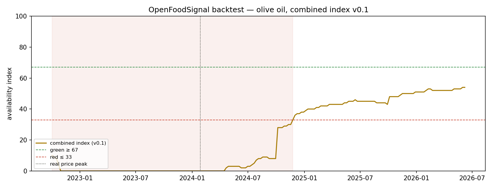

# Backtest report — olive oil index v0.1

*Auto-generated by `backtest.py` on 2026-06-12. Window: 2022-10-02 to 2026-06-07 (193 weeks).*

## Core question

Would the index have flagged the 2022–2024 olive oil crisis — and how early?

## Findings

- The traffic light turned **red on 2022-10-02** and stayed red for 113 weeks (minimum index: 0).
- The real producer price peaked on **2024-01-28** (760.5 €/100 kg, deflated).
- **Lead time red → price peak: 483 days (~69 weeks).** Retail shelf prices lag producer prices further, so consumer-facing lead time is larger still.

All red episodes detected (≥ 4 consecutive weeks):

| first red | last red | weeks | min index |
|---|---|---|---|
| 2022-10-02 | 2024-11-24 | 113 | 0 |

## Limitations (v0.1)

- Balance data are *as revised today*, not as known at the time; a point-in-time backtest would require archived data vintages.
- Pillar A uses the coverage proxy (stocks / 5y mean production) and is assigned to all weeks of its crop year, assuming in-season estimates.
- Pillar C (harvest outlook) is not implemented yet — the measured lead time is a **lower bound** for the full model.
- Score saturation (hard clamp at 0/100) is a known open issue; unclamped z-scores are preserved in the pillar series.
